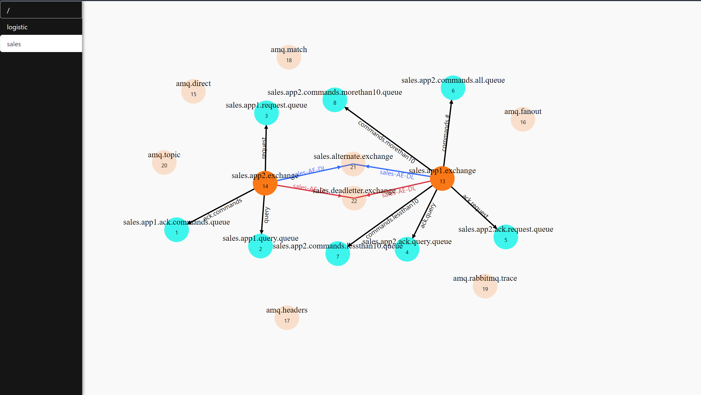

# RabbitMQ Visualizer

It connect to your RabbitMQ instance and show complete map of it by vhosts :

Links legend :
 * **Black** : Binding
 * **Red** : DeadLetter (by policy)
 * **Blue** : Alternate (by policy)

Nodes legend :
 * **Orange** : Exchange
 * **Cyan** : Queue